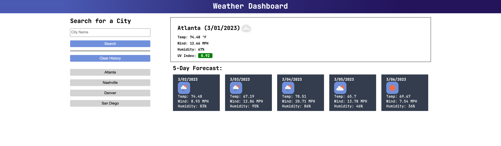

# { Weather Dashboard }

## Description

A weather dashboard using various endpoints from the OpenWeather API.

## Table of Contents (Optional)

- [Installation](#installation)
- [Usage](#usage)
- [Credits](#credits)
- [License](#license)

## Installation

What are the steps required to install your project? Provide a step-by-step description of how to get the development environment running.

## Usage

Provide instructions and examples for use. Include screenshots as needed.

To add a screenshot, create an `assets/images` folder in your repository and upload your screenshot to it. Then, using the relative filepath, add it to your README using the following syntax:

    ```md
    
    ```

## Credits

[Client-Server Model](https://developer.mozilla.org/en-US/docs/Learn/Server-side/First_steps/Client-Server_overview)
<br>

[JSON](https://developer.mozilla.org/en-US/docs/Web/JavaScript/Reference/Global_Objects/JSON)
<br>

[URLs](https://developer.mozilla.org/en-US/docs/Web/API/URL)
<br>

[HTTP GET Method](https://developer.mozilla.org/en-US/docs/Web/HTTP/Methods/GET)
<br>

[HTTP Status Codes](https://developer.mozilla.org/en-US/docs/Web/HTTP/Status)
<br>

[Fetch API](https://developer.mozilla.org/en-US/docs/Web/API/Fetch_API)
<br>

[cURL](https://curl.se/docs/httpscripting.html)
<br>

[Location API](https://developer.mozilla.org/en-US/docs/Web/API/Location)
<br>

## License

Please refer to LICENSE.md in the repository.

## Repository

[Repository](https://github.com/davidmichaelmackey/weather-dashboard/)

## Deployment

[Weather Dashboard](https://davidmichaelmackey.github.io/weather-dashboard/)
