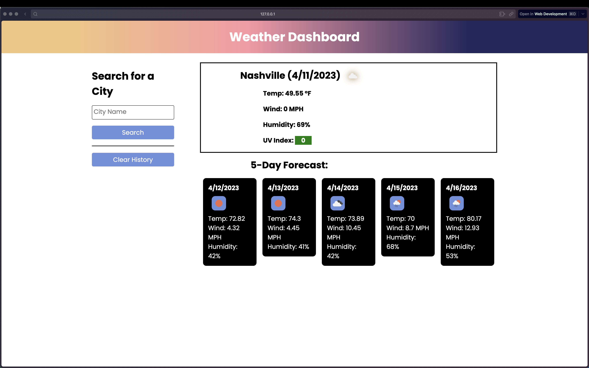

# { Weather Dashboard }

:partly_sunny:

## Badges

 

## Table of Contents

- [Description](#description)
- [Links](#links)
- [Usage](#usage)
- [Credits](#credits)
- [License](#license)
- [Contribute](#contribute)
- [Questions](#questions)

## Description

This web application provides the user with the current weather data of any known city as well as displaying a future 5-day forecast. The application stores previous search history in local storage and displays them when the page is loaded again.

## Links

[Repository](https://github.com/davidmichaelmackey/weather-dashboard) 
[Deployment](https://davidmichaelmackey.github.io/weather-dashboard/)

## Usage

## Credits

:bust_in_silhouette: [David Michael Mackey](https://www.notion.so/davidmichaelmackey/David-Mackey-a59ce61a996840d6a933e3b135673467?pvs=4) 
:email: [Email](mailto:davidmackey@hey.com) 
:octocat: [GitHub](https://github.com/davidmichaelmackey/) 
:briefcase: [Linkedin](https://linkedin.com/in/davidmichaelmackey/) 

### Resources

[Client-Server](https://developer.mozilla.org/en-US/docs/Learn/Server-side/First_steps/Client-Server_overview) 
[JSON](https://developer.mozilla.org/en-US/docs/Web/JavaScript/Reference/Global_Objects/JSON) 
[URL](https://developer.mozilla.org/en-US/docs/Web/API/URL) 
[GET](https://developer.mozilla.org/en-US/docs/Web/HTTP/Methods/GET) 
[Status](https://developer.mozilla.org/en-US/docs/Web/HTTP/Status) 
[Fetch](https://developer.mozilla.org/en-US/docs/Web/API/Fetch_API) 
[cURL](https://curl.se/docs/httpscripting.html) 
[Location](https://developer.mozilla.org/en-US/docs/Web/API/Location) 

## Toolset

      
      
      
      
      
      

## License

  

## Contribute

[Contributor Covenant](https://www.contributor-covenant.org/)

## Questions

Have Questions?
 
Feel free send me an [email](mailto:davidmackey@hey.com) or reach out to me on [Linkedin](https://linkedin.com/in/davidmichaelmackey/).
